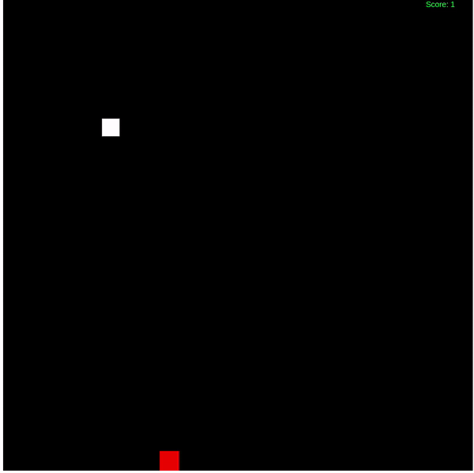

# Snake Game
This is a basic snake game using HTML and Typescript, the main reason for build this game is just only for study structured data and algorithms in game development, also try to apply clean code and SOLID concepts. Its simple but with good concepts

How to run? 

> Run Build to transpile typescript code to javascript into de dist folder.

> npm run build (convert typescript code to javascript into dist folder)

> Open HTML file on http://127.0.0.1:5500/src/view/game.html and enjoy!

